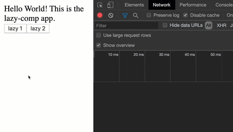

# angular-lazy-load-demo

Lazy loaded component demo.

> You can [learn more from this article here](https://johnpapa.net/angular-9-lazy-loading-components/).

## Quick Start

Angular 9 is required.

1. Clone this repo `git clone git@github.com:johnpapa/angular-lazy-load-demo.git`
1. Run `cd angular-lazy-load-demo`
1. Run `ng serve` for a dev server.
1. Navigate to `http://localhost:4200/`

## Learn More

These examples should be able to help you get started with lazy loading components dynamically, with or without children. If you want to learn more, check out these resources:

1. [Dynamic Component Loader](https://angular.io/guide/dynamic-component-loader)
1. [7 new features in Angular 9](https://auth0.com/blog/angular-9-whats-new/).
1. [VS Code](https://code.visualstudio.com/?wt.mc_id=angular_lazy_load_demo-github-jopapa) editor
1. [Angular Essentials Extension](https://marketplace.visualstudio.com/items?itemName=johnpapa.angular-essentials&wt.mc_id=angular_lazy_load_demo-github-jopapa) for VS Code
1. [Angular Language Service](https://marketplace.visualstudio.com/items?itemName=Angular.ng-template&wt.mc_id=angular_lazy_load_demo-github-jopapa) for VS Code
1. [Angular Lazy Load Demo source code](https://github.com/johnpapa/angular-lazy-load-demo)
